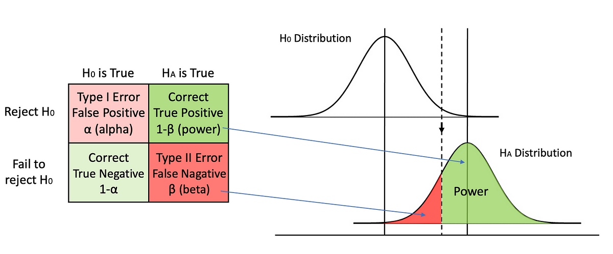
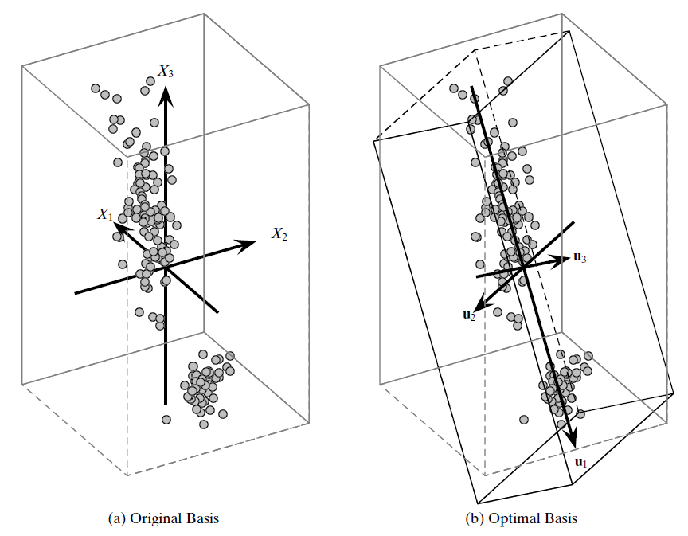

# 2. Statistika

> Důkladná znalost základních statististických metod ([bodové odhady](#bodové-odhady), [intervaly spolehlivosti](#intervaly-spolehlivosti-confidence-intervals-ci), [testování statistických hypotéz](#statistické-testy)). [ANOVA](#anova-analysis-of-variance). Neparametrické testy hypotéz. Mnohonásobná lineární regrese, autokorelace, multikolinearita. [Analýza hlavních komponent (PCA).](#pca) (MA012)

## Úvod

### Proč statistika?

- deskriptivní (popisná) statistika
    - o daném jevu nic nevím, chci popsat získaná data
    - napříkla "jaký je náš průměrný věk" - každý mi řekne věk, spočítám průměr
- inferenční statistika
    - testování hypotéz, zobecňování zjištění na populaci
        - populace - celá množina, která nás zajímá (př. všichni lidi)
        - vzorek, reprezentativní vzorek - podmnožina, kterou testuji

### Hypotézy

- vždy, když chci ve statistice něco tvrdit, tak buď je to nějaký popis (průměr je X), nebo musím mít hypotézu
- hypotézy nelze potvrzovat, pouze zamítat
- **nulová hypotéza $H_0$** - nic se neděje, normální stav
    - to chci zamítnout
- **alternativní hypotéza $H_A$** - změna, to je to, co chci tvrdit
- $H_0$ a $H_A$ vždy komplementární, jedna z nich musí platit!

### P-hodnota

- pravděpodobnost, že pozorujete výsledky, které pozorujete (nebo extrémnější), za předpokladu, že nulová hypotéza platí
- p-hodnota pouze pomůže rozhodnout, jestli zamítáme nebo ne, žádným způsobem neměří "jak moc" je efekt významný
- nezamítnutí $H_0$ neznamená, že $H_0$ je pravdivá!
- pozor, p-hodnota není pravděpodobnost $H_0$, ani pravděpodobnost, že neplatí $H_A$

### Hladina významnosti a chyby I. a II. typu

- **hladina významnosti $\alpha$**
    - pravděpodobnost, že $H_0$ zamítáme, i když ve skutečnosti platí
- chyba I. typu, falešná pozitivita
    - pravděpodobnost, že $H_0$ zamítáme, i když ve skutečnosti platí
    - pravděpodobnost $\alpha$, můžeme si zvolit, vyšší s vyšším $\alpha$
- chyba II. typu, falešná negativita
    - pravděpodobnost, že $H_0$ nezamítáme, i když ve skutečnosti neplatí
    - pravděpodobnost jen odhadnutená, závisí na testu, počtu měření (čím víc tím menší), snižuje se s vyšším $\alpha$
- jak zvolit $\alpha$? 
    - příklad: testuji, zda má pacient nějakou nemoc a mám zahájit léčbu
        - $H_0$ zdravý pacient, $H_A$ nemocný pacient
        - možnost 1: léčba je zdarma a neinvazivní, stačí každé ráno vypít sklenici džusu, pokud ale nezačnu s léčbou včas, tak to může dopadnout špatně
            - nevadí, když občas řeknu i někomu, kdo nemoc nemá, že ji má, protože pití džusu nemůže uškodit
            - nevadí mi tolik chyby I. typu, chci se vyvyrovat chyb II. typu (nediagnostikuji někoho, kdo nemoc má)
            - volím vyšší hladinu významnosti
        - možnost 2: léčba je velmi nákladná, má ošklivé vedlejší účinky, nemoc je vážná a vyslechnutí diagnózy bude mít dramatický vliv na pacientovu psychickou pohodu, nemoc nepostupuje příliš rychle
            - chci se vyhnou chybě I. typu (neříkám zbytečně lidem, že tuhle nemoc mají)
            - volím nižší hladinu významnosti
        - v reálném světě složitější, než tento příklad    
    - typicky se používá 5% nebo 1% (v medicíně), ale je to určeno vlastně náhodně, konvence, není důvod, proč by 5% mělo být lepší než 4%

## Statistické testy

- matematický nástroj, který nám pomůže určitě, jestli na hladině významnosti $\alpha$ a při pozorování daných dat zamítáme $H_0$

### Postup

*Chceme získat znalost o nějaké vlastnosti světa, tedy pravděpodobnostní distribuce, ze které pochází data.*

1. rozmyslíme **hypotézy**, a model světa
2. vybereme nějakou vhodnou **testovou statistiku**
    - *číslo, které popisuje data*
    - důležité je, že víme, jaké rozdělení pravděpodobnosti bude tahle testová statistika mít, pokud platí $H_0$
        - př. průměr se bude pro hodně měření blížit střední hodnotě
3. zvolíme **hladinu významnosti** $\alpha$
4. spočítáme **hodnotu testové statistiky** pro naše data
    - tj. pokud je naše testová statistika výběrový průměr, spočítáme průměr
- **teď známe rozdělení pravděpodobnosti testové statistiky, pokud platí $H_0$ a její konkrétní hodnotu pro naše data**
5. spočítáme **p-hodnotu**, tedy pravděpodobnost, že pozoruji danou hodnotu testové statistiky za předpokladu, že platí $H_0$
    - můžu najít v tabulkách (kritická hodnota testové statistiky pro vybrané hladiny významnosti)
6. **zamítneme** $H_0$ ve prospěch $H_1$ pokud $p<\alpha$
 
### Předpoklady

- statistické testy mají předpoklady
- předtím, než se pustíme do testování nějakým testem, musíme jeho **předpoklady ověřit**
    - jinak si třeba budeme myslet, že víme, jaké rozdělení pravděpodobnosti má naše testová statistika, ale nebude to pravda
        - něco spočítáme (protože dosadit do vzorečků můžeme), ale to něco nemá žádnou hodnotu!

## Bodové odhady

- <https://bookdown.org/egarpor/inference/point.html>
- <https://portal.matematickabiologie.cz/index.php?pg=analyza-a-hodnoceni-biologickych-dat--statisticke-modelovani--zakladni-pojmy-matematicke-statistiky--bodove-odhady>
- chceme odhadnout jeden číselný parametr distribuce, ze které pocházejí data, na základě vzorku dat
    - př. střední hodnota, rozptyl
- odhadujeme pomocí výběrové charakteristiky (= funkce náhodného výběru)
- odhadovaný parametr $\theta$, odhad $\hat{\theta}$

### Vlastnosti bodových odhadů

- **nestrannost (nevychýlenost, nezkreslenost) - bias**
    - odhad je nestranný, pokud $\mathbb{E}(\hat{\theta})=\theta$
        - alternativně, pokud $Bias[\hat{\theta}]= \mathbb{E}(\hat{\theta})-\theta=0$
    - odhad je asymptoticky nestranný, pokud $\lim_{n \to \infty}\mathbb{E}(\hat{\theta})=\theta$
    - existuje mnoho dobrých odhadů, které nejsou nestranné
    - pro jeden parametr může existovat více nestranných odhadů
- **vydatnost (eficience)**
    - "aby bodové odhady byly rozloženy co nejtěsněji kolem odhadovaného parametru", tedy pokud budeme mít dva nestranné odhady, vybereme si ten s menším rozptylem
    - nestranný odhad, jehož rozptyl je nejmenší mezi všemi nestrannými odhady příslušného parametru, se nazývá nejlepší nestranný (eficientní) odhad
- **konzistence**
    - odhad je konzistentní (consistency in squared mean), pokud se s rostoucím rozsahem výběru ($n$) zpřesňuje, tedy:
        - $\hat{\theta}$ je asymptoticky nestranný, tedy $\lim_{n \to \infty}\mathbb{E}(\hat{\theta})=\theta$
        - $\lim_{n \to \infty}var(\hat{\theta})=0$
    - consistency in squared mean implies consistency in probability
    - polopatě: užívání konzistentních odhadů zaručuje
        - malou pravděpodobnost velké chyby v odhadu parametru, pokud rozsah výběru dostatečně roste
        - volbou dostatečně velkého počtu pozorování lze učinit chybu odhadu libovolně malou
- **dostatečnost**
    - odhad parametru je dostatečný, jestliže obsahuje veškerou informaci o sledovaném parametru, kterou může výbýrový soubor poskytnout (žádný jiný parametr neobsahuje větší množství informace o výběrovém souboru)
- bodový odhad je náhodná veličina
    - i v případě, že splňuje všechny vlastnosti výše, může se lišit od skutečného parametru $\to$ **výběrová chyba** $(\hat{\theta}-\theta)$
    - je-li $\hat{\theta}$ nezkresleným odhadem parametru $\theta$, můžeme měřit přesnost odhadu jeho směrodatnou odchylkou (nazývá se pak *střední chyba*)

### Příklady bodových odhadů

- střední hodnotu (expected value) $$\mathbb{E}[X]=\sum_x x\cdot P(X=x) = \int_{-\infty}^{\infty} x\cdot f(x) dx$$ odhadujeme pomocí **výběrového průměru** $$\overline{X} = \frac{1}{n}\sum_{i=1}^n X_i$$
    - nejlepší nestranný odhad střední hodnoty
    - dostatečný odhad střední hodnoty (využívá všechno z výběru, na rozdíl třeba od mediánu)
- rozptyl (variance) $$\begin{split} var(X) & = \mathbb{E}[(X-\mathbb{E}[X])^2] = \mathbb{E}[X^2]-(\mathbb{E}[X])^2 = \\ & = \sum_x (x-\mathbb{E}[X])^2\cdot P(X=x) = \\ & = \int_{-\infty}^{\infty} (x-\mathbb{E}[X])^2 \cdot f(x) \, dx \end{split}$$ odhadujeme pomocí **výběrového rozptylu** $$S_X^2= \frac{1}{n-1}\sum_{i=1}^n (X_i-\overline{X})^2$$
    - obecně není nestranný (unbiased) odhad
    - v případě náhodného výběru z normálního rozdělení je výběrový rozptyl nejlepším nestranným odhadem rozptylu
- směrodatnou odchylku (standard deviation) $$\sigma_X=\sqrt{var(X)}$$ odhadujeme pomocí **výběrové směrodatné odchylky** $$S_X=\sqrt{S_X^2}$$

### Intervaly spolehlivosti (confidence intervals, CI)

- intervalový odhad = arametr aproximujeme intervalem, v němž s velkou pravděpodobností daný parametr leží
- může být jednostranný nebo dvoustranný
- <https://bookdown.org/egarpor/inference/confint.html>
- říkají, "jak (ne)přesný" je bodový odhad nějakého parametru
    - "střední hodnota odhadu $\pm$ jeho rozptyl"
- hladina spolehlivosti: $1-\alpha$, kde $\alpha$ je hladina významnosti
    - v praxi hledáme kompromis mezi psolehlivostí a významností
- definice: $$CI_{1-\alpha}(\theta)=[T_{inferior}(x_1,\ldots,x_n),T_{superior}(x_1,\ldots,x_n)]$$ where $T_{inferior},T_{superior}$ jsou bodové odhady takové, že $$P(T_{inferior}\leq \theta \leq T_{superior})\geq 1-\alpha$$ pro všechny možné hodnoty $\theta$
- bootstraping nám může pomoct s konstrukcí různých druhů konfidenčních intervalů

#### Příklad: interval spolehlivosti pro střední hodnotu pro normální rozdělení

- předpokládejme sledovanou náhodnou veličinu $X$, známe její rozptyl $\sigma^2$
- víme, že pro dostatečně velký rozsah výbýru ($n\to \infty$) je rozdělení průměru
asymptoticky normální se střední hodnotou $\mu$ a rozptylem  $\sigma^2/n$, tedy
$$
\overline{X}\to N\left(\mu;\frac{\sigma^2}{n}\right)
$$
- definujeme náhodnou veličinu $Z$ jako $$ Z = \frac{\overline{X}-\mu}{\sqrt{\frac{\sigma^2}{n}}}=\sqrt{n}\cdot\frac{\overline{X}-\mu}{\sigma}$$ a víme, že $Z$ má normované normální rozdělení $Z\to N(0;1)$
- nechť $z_{a/2}$ a $z_{1-a/2}$ jsou $100\cdot (a/2) \%$ a $100\cdot (1-a/2) \%$ kvantily normovaného normálního rozdělení, pak můžeme tvrdit, že $$P(z_{a/2} < Z < z_{1-a/2})=1-\alpha$$ $$P(z_{a/2} < \sqrt{n}\cdot\frac{\overline{X}-\mu}{\sigma} < z_{1-a/2})=1-\alpha$$
- úpravou dostaneme oboustranný interval $$P(\overline{X}-\frac{\sigma}{\sqrt{n}}z_{a/2} < \mu < \overline{X}+\frac{\sigma}{\sqrt{n}}z_{1-a/2})=1-\alpha$$

## t-test

- porovnávání středních hodnot, buď jedné proti konstantě (jednovýběrový), nebo dvou proti sobě (dvouvýběrový)
- používá testovou statistiku $t$, která se spočítá z průměru (odhad střední hodnoty), výběrového rozptylu (odhad rozptylu) a počtu měření 
    - má známé t-rozdělení (viz obrázek)
        - jako jeho parametr se obvykle udává počet stupňů $\nu$ volnosti
        - pro $\nu \to \infty$ se blíží k normálnímu, pro $n>30$ už je to dobrá aproximace (takže pokud chceme použít tenhle test, tak chceme mít alespoň 30 měření)
    - nechť $X_i$ pro $i=1..n$ je $n$ naměřených hodnot náhodné veličiny $X$ (analogicky pro $Y$ a $m$)
    - jednovýběrový: $t=\frac{\bar{X}-\mu}{S_X/\sqrt{n}}$
        - $\bar{X} = \frac{1}{n}\sum_{i=1}^{n}X_i$ průměr, odhadujeme jím střední hodnotu
        - $S_X^2=\frac{1}{n-1}\sum_{i=1}^{n}(X_i-\bar{X})^2$ výběrový rozptyl, odhaduje rozptyl ($S_X$ se jmenuje výběrová směrodatná odchylka)
        - počet stupňů volnosti $n-1$
    - dvouvýběrový: $t =\frac{\bar{X}-\bar{Y}-\delta}{\sqrt{(n-1)S_X^2+(m-1)S_Y^2}}\sqrt{\frac{nm(n+m-2)}{n+m}}$ 
        - $\delta$ předpokládaný rozdíl středních hodnot, obvykle 0
        - počet stupňů volnosti $n+m-2$
- předpoklady: spojitá data, náhodný vzorek a nezávislá měření (pro závislá existuje párový test), homogenita rozptylu (pro párový t-test, rozptyly obou skupin jsou zhruba stejné), normalita

## ANOVA (ANalysis Of VAriance)

- testujeme střední hodnoty $n$ skupin ($n \geq 3$, jinak t-test) odhaduté pomocí průměrů $\to$ na hladině významnosti $\alpha$ testujeme hypotézy $H_0$ a $H_1$
    - $H_0$: všechny skupiny mají stejnou střední hodnotu
    - $H_1$: **alespoň dvě z $n$ skupin mají rozdílné střední hodnoty** 
- jednotlivé skupiny jsou stochasticky nezávislé
- $i$-tá skupina obsahuje $n_i$ měření $Y^i_1,...,Y^i_{n_i}$, náhodný vzorek z normální pravděpodobnostní distribuce
- proč ne opakovaný t-test? 
    - multiple testing problem - když opakujeme test hodněkrát, tak nám náhodou nakonec jednou vyjde, protože to je taky jenom pravědpodobnost
- předpoklady
    - homogenita rozptylu - rozptyly ve skupinách (alespoň přibližně) stejné
        - testy: Levene’s test, Bartlett’s test
    - normalita - data ve skupinách normálně rozdělená
        - protože porovnáváme s kvantily F-rozdělení
        - testy: Lilliefors test, Shapiro–Wilk test (graficky: QQ-plot)
- pokud zamítneme $H_0$, zajímá nás, které dvojice skupin se liší
    - metody mnohonásobného porovnávání:
        - **Tukeyho metoda** - pokud máme podobné velikosti náhodných vzorků
        - **Scheffeho metoda** - hodně různorodé velokosti náhodných vzorků

### Model jednofaktorové ANOVA

- "jednofaktorová" - data na skupiny dělíme podle jednoho parametru
    - př. odrůda brambor (ale ne zárověň ještě pole, na kterém byly pěstovány)
- pozorování $Y_{ij}$ dopovídají modelu $M_A$ pokud $$Y_{ij} = \mu + \alpha_i + \epsilon_{ij} = \mu_i + \epsilon_{ij}$$ kde $\mu$ je celkový průměr, $\alpha_i$ je efekt skupiny $i$, $\mu_i$ je průměr skupiny $i$ a $\epsilon_{ij}$ jsou náhodné chyby
    - **TODO** střední hodnota vs průměr
    - ekvivalentní zápis hypotéz:
        - $H_0: \alpha_1 = ... = \alpha_n = 0$, $H_1: \exists i: \alpha_i \neq 0$
        - $H_0: \mu_1 = ... = \mu_n$, $H_1: \exists i,j: \mu_i \neq \mu_j$
    - za podmínky $H_0$ můžeme pozorování $Y_{ij}$ modelovat pomocí nulového modelu $M_0: Y_{ij}=\mu+\epsilon_{ij}$, který je submodelem $M_A$ 
- vícefaktorová ANOVA

## Mnohonásobná lineární regrese

## PCA

- analýza hlavních komponent - statistická metoda pro redukci dimenzionality dat
- rotace ortonormální báze vektorového prostoru náhodných proměnných
    - hlavní komponenty (tedy nová báze) jsou nekorelované
        - vysvětlují co nejvíc z variability dat (rozptylu)